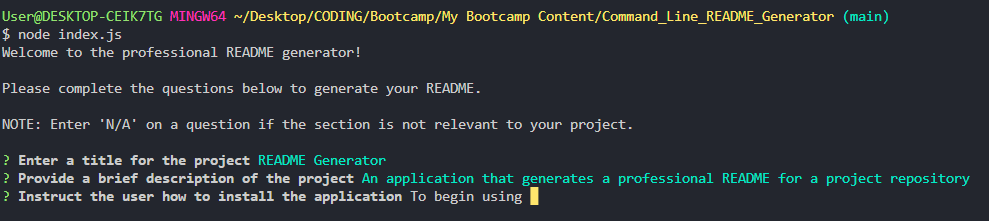

# Command_Line_README_Generator 

  

## Description 
An application that generates a professional README for a project repository from a Command Line Interface 

## Table of Contents

- [Installation](#installation)
- [Usage](#usage)
- [Credits](#credits)
- [Tests](#tests)
- [Questions](#questions)
- [Licence](#licence)

## Installation
 
Ensure you are in the same directory as the 'index.js' file of the application. Initially, in the command line, type 'npm init-y' to create a 'package.json' file. Then, type 'npm i inquirer@6.5.0' which will install a working version of Inquirer. The application is then ready to use. 

## Usage

To begin using the application, confirm the working directory contains the relevant 'index.js' file, and type 'node index.js' into the command line. The user will then be prompted with a number of questions by which the README will be generated. 

There are specific character limits and validations for each question, which can be shown by pressing enter with no value inputted on a question. A project title and description must be inputted, but the user can enter 'n/a' in sections which are not relevant. The exception to this occurs when the user is prompted to confirm if they require a screenshot. Please enter 'y' or 'n' to confirm or deny the request. 

Further, the user must select a licence for the project from the provided list to generate the README. 

## Credits

Elijah Wilsher 

## Tests

n/a

## Questions

Github: https://github.com/Yusen22 &nbsp;&nbsp;&nbsp;&nbsp;&nbsp;&nbsp;Email: elijahwilsher@gmail.com 

Any questions on this project can be directed to the above email address or Github account.

## Licence

MIT
